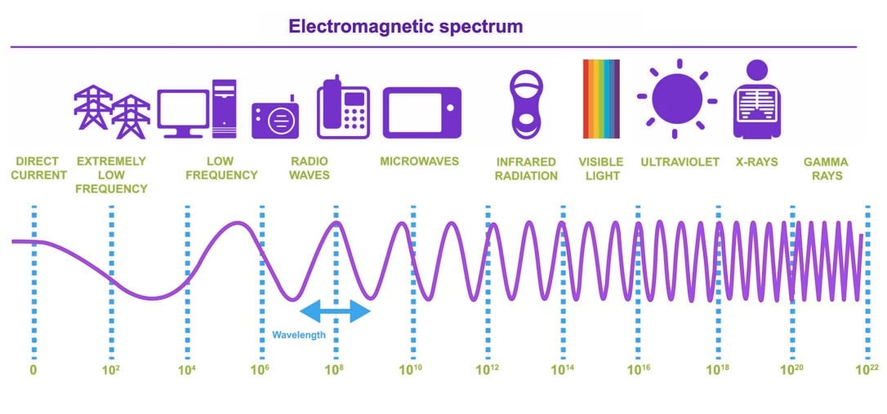

# RF 101 - from Hz, to GHz in 1h

## Who am I?

* Hacker

* I am addicted to cool hobies

* No formal education in RF

* I learn by doing

* I may be wrong, so, make sure to correct me, so we both learn

* My employer does not care if my opinion is considered to reflect theirs

## Oscillation

* Constant

* Sinewave

## Resonance

* Capacitance

    * Reservoir and water that changes flow speed

* Inductance

    * Heavy pendulum and inertia

* Capacitance and inductance cancel each other out and we get resonance

* Antenna "likes" to *transmit* and *receive* energy of that frequency

* Antenna can be RF antenna, microphone/speaker, light source/sensor, etc.

## Frequency and wavelength

* Frequency is how many times per second oscillation happens (Hz)

    * Hz, kHz, MHz, THz...

* Wavelength is how much wave travels during one oscillation (m)

## Amplitude

* In case of sound, it is air pressure

* In case of RF, it is dBm

* What is dB?

    * 0dB = 1x

    * 10dB = 10x

    * 20dB = 100x

    * 30dB = 1000x

* Why dB?

    * Huge amount of dynamic range

    * Inverse square law - not linear

* What is dBm then?

    * dBm is power compared to 1mW

    * -10dBm = 0.1mW

    * 10dBm = 10mW

## Filtering

* You can extract that oscillation from sum of a lot of oscillations

* Antenna is a filter

* Frequency response

## Modulation

* How do we encode useful data in oscillation

* We turn it on/off?

* We change amplitude?

* We slightly change frequency?

* We slightly change phase?

## What is phase?

* Rewinding or jumping around sinewave

## Digital modulation, and effects of square signal on RF (harmonics)

* Squarewave signal contains frequency elements of a lot of frequencies

* More bandwith

* Filtering before transmitting

## Mixing

* You can shift around that oscillation to other frequencies

* New signal is sum and difference of new signals

## IQ signal

* When mixing in the middle of some signal, it gets reflected on both sides of 0Hz

* To combat that, we mix it with same frequency, with 90 degrees offset and we digitize it as 2 different signals

* This allows us to have negative frequencies

## Digitizing

* Nyquist rule

    * 20MSPS ADC can reliably capture 10Mhz signal

* ADC (analog to digital converter) is a filter

* Frequency response of ADC

* Dynamic range

* AGC (automatic gain control)

## Digital filtering

* CPU intensive

## Digital mixing

Really simple

## Impedance and impedance matching

* Impedance match == you are sending V that is "expected" further on in the circuit

* When you turn on circuit, you see ringing, that is caused by impedance mismatch

* We induce current in return path, in reverse direction

* We "prepare" flow of current for impedance of termination (antenna)

* 50Ohm as standard - good balance between power handling and loss

* VSWR (or SWR, as hams call it) - difference between expected impedance (50Ohm -> 75Ohm == 1:1.5 VSWR)

* Reflection can fry transmitter

* Reflections cause distortion

* Smith chart

## Tuning antenna

* Antenna is "terminator" for transmission line

* Needs to be the same impedance as transmission line (or we need impedance transformer)

* We are measuring how good antenna terminates circuit, but not really how good antenna is (50Ohm resistor)

* Antenna radiation pattern and gain

    * Reference antenna - dBd and dipole - dBi isotropic antenna (does not exist)

* Field strength measurement (0dBi antenna)

## Spectrum analysis

* We can measure power over frequencies

## SDR uses for hackers

* Replay attack

* Using URH to figure out modulation parameters and demodulate data

* YardStickONE and other based CC1101 or similar chips for TX and RX

    * Once you know modulation parameters, fastest way to implement RX and TX is using modems that are premade

* Tools like flipper zero try to take data, recognize it and understand the meaning

    * Rolling code

    * Encryption (Keeloq)

* Rolljam

## Contact

* [github.com/nemanjan00](https://github.com/nemanjan00)

* [x.com/nemanjan00](https://x.com/nemanjan00)
